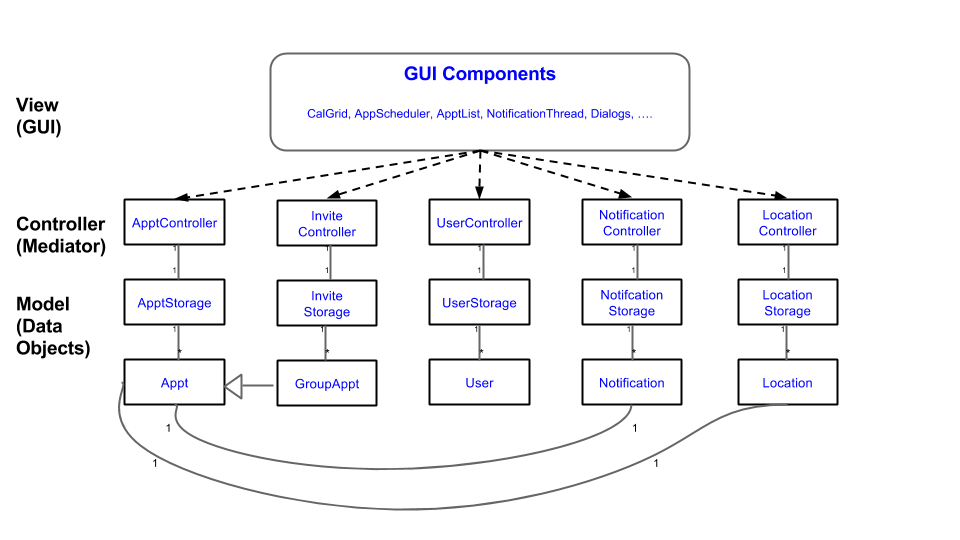

# Mediator Pattern

## Motivation

The calendar project requires numerous GUI components and data components to communicate simultaneously and complex integration due to many relationships among different data objects. 
For this reason, if handling of data is implemented on the GUI side, it is impossible track down where data components are modified or created.
Also, if integration among different data objects are all done on the unit side, it is not possible to handle many data objects at the same time. 

## Solution

We imitated the Model-View-Controller(MVC) architecture from the web application platform, Ruby on Rails, to mediate the model(data object) and view(GUI component) with having controllers.
Controllers, each of which hold data objects like Appt, User, Notification, Invitation, and Location, are implemented in singleton pattern, so that GUI components easily communicate with data objects through them.
Integrations among different data objects, such as Appt and Notification, or User and Appt, are handled through different methods of controllers. 
As a result, each controller has one-to-many relationship with data objects, which makes the code maintenance simpler with centralized control logic.

## Class Diagram

  